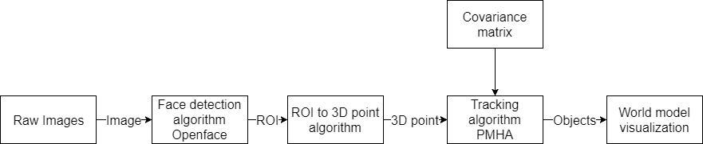
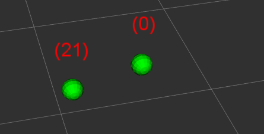

This project was used for my BEP multiple face detection and tracking under occlusion. 
 
It uses  <a href="https://www.w3schools.com/html/">Openface</a> to get ROIs from raw images using the kincet xbox 360 camera. Then it transform the ROIs to 3D points using <a href="https://www.w3schools.com/html/">get_3d_point_from_image_roi_node.cpp</a> and the depth information of the kinect camera. This 3D points are x,y,z coordinates with respect to the kinect camera. 
 
After that the 3D points together with a specified covariance (in this case the covariance matrix is a constant but can be made dependent on the rate of change of the x,y,z coordinates. Because most probable faster movements will have larger covariance matrices.) are fed into <a href="https://www.w3schools.com/html/">WIRE</a>. Wire generates and maintains one consistent world state estimate based on object detections. It solves the data association problem by maintaining multiple hypotheses and facilitates tracking of various object attributes.  
 
 
 
In the end a world model is obtained with the x,y,z coordinates and respective covariance matrix of detected faces together with an ID number per face in one world model. Visualized in RVIZ 
 
 
 
BEP_project_face_tracking 
